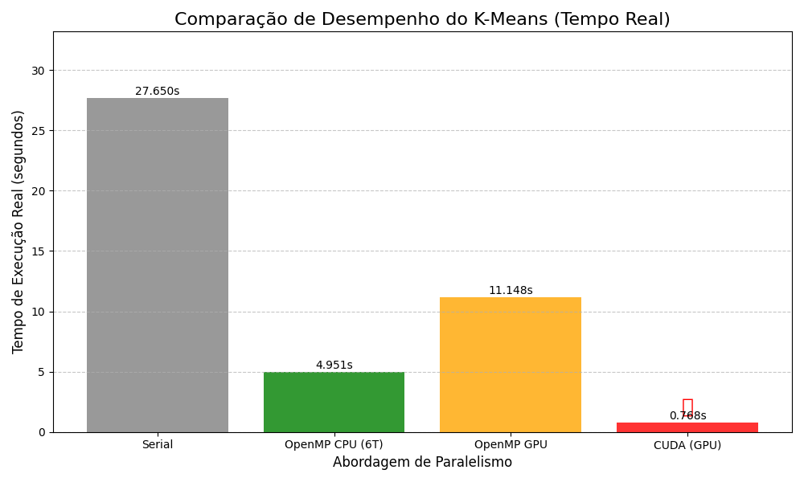
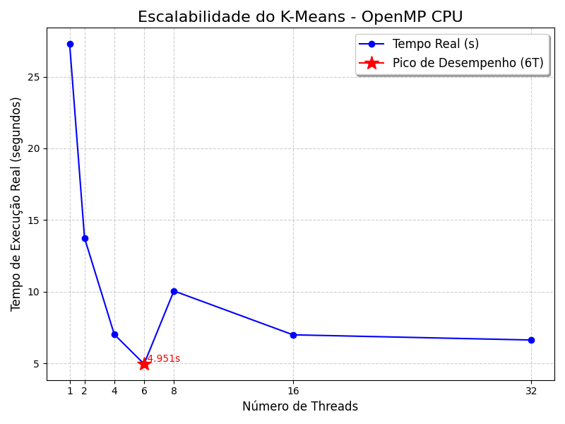

# Trabalho Prático de Computação Paralela

O objetivo deste trabalho é implementar e analisar a escalabilidade de uma aplicação de Inteligência Artificial (IA) através de diferentes paradigmas de programação paralela (OpenMP e CUDA).

---

### Aplicação e Requisitos de Implementação

O grupo deve escolher uma aplicação de IA de uma das seguintes categorias:

* **Árvore de Decisão:** Exemplo: ID3
* **Agrupamento (Clustering):** Exemplo: **K-Means** (Seu caso)
* **Rede Neural:** Exemplo: Perceptron Multicamadas

#### Versões a Serem Implementadas e Paralelizadas (3 Paralelas + 1 Sequencial):

1.  **Versão Sequencial (Base):** Implementação em C/C++.
2.  **Versão Paralela i) (OpenMP CPU):** Utilizando diretivas OpenMP para paralelização em *multicore* (CPU).
3.  **Versão Paralela ii) (OpenMP GPU):** Utilizando *OpenMP Offloading* para GPU.
4.  **Versão Paralela iii) (CUDA GPU):** Implementação direta utilizando a API CUDA.

### Requisitos e Documentação

O trabalho deve ser executado e documentado conforme os requisitos abaixo:

#### A. Requisitos de Código e Dados

| Requisito | Detalhe |
| :--- | :--- |
| **i) Base de Dados Real** | Utilizar uma base de dados de entrada real que exija no mínimo **10 segundos** de tempo de execução na **versão sequencial** no servidor de teste (ou computador pessoal/PARCODE). |
| **ii) Código Base** | A versão sequencial **não** precisa ser desenvolvida do zero; códigos abertos podem ser utilizados, desde que o **link para o código-fonte original** seja fornecido. |
| **iii) Comentários de Código** | Deixar **comentado no código** todas as mudanças realizadas para a paralelização. |
| **iv) Medições em Código** | Incluir **comentado no início do código** os tempos de execução da versão sequencial e paralela para **1, 2, 4, 8, 16 e 32 threads** em CPU (OpenMP). |
| **vi) CUDA Kernel** | Não é obrigatório testar diferentes tamanhos de kernels em CUDA. |

#### B. Requisitos de Documentação

O grupo deve criar um arquivo `readme.txt` contendo:

1.  **Instruções de Compilação e Execução** para todas as versões (Sequencial, OpenMP CPU, OpenMP GPU, CUDA).
2.  **Explicação** detalhada sobre a aplicação escolhida (ex: como o K-Means funciona).
3.  **Tempos de Execução** medidos para todas as versões.
4.  Comprovação de que as **versões paralelas apresentam speedup escalável** em relação à versão sequencial.

## Ambiente de Execução

Os testes foram executados localmente, não no PARCODE.

### OS 

Ubuntu 24.04.03  
Kernel: 6.14.0-36-generic

### CPU

AMD Ryzen 5 3500X 6-Core Processor
- 6 núcleos físicos
- 6 threads (1 thread por núcleo)
- 1 socket

### GPU

NVIDIA GeForce GTX 1660 SUPER
- Memória: 6 GB GDDR6
- Driver: 580.95.05
- CUDA: 13.0
- TDP: 125W

### RAM 

16 GB (15.5 GiB disponível)

## Kmeans

ML nao supervisionado paramétrico para clustering.

### Algoritimo

```txt
1. Escolher K centróides iniciais.

2. Repita até convergir ou atingir número máximo de iterações:

    # --- --- Atribuição --- ---
    2.1 para cada ponto/instância i:

            para cada cluster k:
                calcular distância(point[i], centroid[k])

            atribuir ponto i ao cluster com menor distância

    # --- --- Atualização --- --- 
    2.1 para cada cluster k:
            recalcular centroid[k] como a média dos pontos atribuídos a k
fim

```

## Implementações

Os códigos desenvolvidos foram baseados em algumas das [fontes citadas abaixo](#fontes), e, sobretudo, na implementacao do kmeans do repositório [TheAlgorithms](https://github.com/TheAlgorithms/C/blob/master/machine_learning/k_means_clustering.c)

### 1. Sequencial

Fonte: [`01_serial_kmeans.c`](./src/01_serial_kmeans.c)
Pré-requisitos: [GCC]()
Executar: 
```bash
mkdir -p bin
gcc src/01_serial_kmeans.c -o bin/kmeans_serial -lm
time ./bin/kmeans_serial
```

Usamos reduction porque, dentro do loop, fazemos a soma das coordenadas para calcular os centróides. 
Se várias threads tentassem atualizar essas somas ao mesmo tempo, os valores seriam sobrescritos e o resultado sairia errado. Com o reduction, cada thread trabalha com uma cópia própria das variáveis soma e cont, faz suas operações de forma independente e, no final, todas essas cópias são agrupadas/combinadas.

### 2. Paralelo com OpenMP para CPU

Fonte: [`02_omp_cpu_kmeans.c`](./src/02_omp_cpu_kmeans.c)
Pré-requisitos: [GCC](), [GCC]()
Executar: 
```bash
mkdir -p bin
gcc src/02_omp_cpu_kmeans.c -o bin/kmeans_omp_cpu -fopenmp -lm
time OMP_NUM_THREADS=1 bin/kmeans_omp_cpu
```
### 3. Paralelo com OpenMP para GPU

Fonte: [`03_omp_gpu_kmeans.c`](./src/03_omp_gpu_kmeans.c)
Pré-requisitos: [GCC](), [GCC]()
Executar: 
```bash
mkdir -p bin
gcc-13 -fopenmp -foffload=nvptx-none -fno-lto ./src/03_omp_gpu_kmeans.c -o ./bin/kmeans_omp_gpu -lm
time ./bin/kmeans_omp_gpu
```

- `-foffload=nvptx-none`: Ativa o Offloading. Informa ao GCC para gerar uma versão do código (o kernel OpenMP) que será executada no dispositivo de aceleração. E `nvptx-none` especifica a arquitetura NVIDIA PTX (Parallel Thread Execution). O GCC gera um código intermediário compatível com GPUs NVIDIA.
- `-fno-lto`: Desativa o LTO (Link-Time Optimization). LTO é um tipo de otimização que ocorre na fase final de linkagem. No sistema (Ubuntu 24.04 com GCC 13), o LTO entra em conflito com o flag de segurança padrão do sistema (-fcf-protection=full). Este conflito impede a geração correta do código para a GPU. (perde uma quantia despresável de performance).

Primeiramente, para a paralelização acontecer são enviados para a GPU apenas os dados que serão utilizados durante as iterações.
Após isso, o comando "target teams distribute parallel for" faz com que a GPU crie vários grupos (teams) contendo múltiplas threads, que ficarão responsáveis por calcular a distância entre os pontos e os centróides. Os centróides são recalculados na CPU, então eles precisam ser enviados novamente para a GPU a cada iteração através do comando "target update to".
O vetor grupo[], gerado na GPU, é copiado de volta para a CPU dentro do próprio loop com "map(from: grupo[0:N])" e por isso
o comando "target exit data" apenas libera a memória da GPU com "map(delete: ...)", sem copiar nada de volta.

### 4. Paralelo com CUDA para GPU

Fonte: [`04_cuda_gpu_kmeans.cu`](./src/04_cuda_gpu_kmeans.cu)
Pré-requisitos: [GCC](), [GCC]()
Executar: 
```bash
mkdir -p bin
nvcc ./src/04_cuda_gpu_kmeans.cu -o ./bin/kmeans_cuda -lm
time ./bin/kmeans_cuda
```

Esse código utiliza CUDA para paralelizar a fase de associação de pontos (o maior gargalo de cálculo) na GPU. O restante da lógica (leitura de dados, inicialização e recálculo de centróides) é executado na CPU.

## Resultados



O gráfico apresentado ilustra a Comparação de Desempenho do algoritmo K-Means, medida pelo Tempo de Execução Real em segundos, utilizando diferentes abordagens de paralelismo. Ele contrasta o desempenho da execução Serial (sem paralelismo) com três implementações paralelas: OpenMP CPU (utilizando 6 threads), OpenMP GPU (com offload para a GPU) e CUDA (GPU).

Essa visualização destaca a grande diferença de desempenho alcançada ao se aplicar técnicas de paralelização. Observa-se que a abordagem Serial é a mais lenta, enquanto as implementações paralelas demonstram reduções significativas no tempo de processamento. Notavelmente, a implementação utilizando CUDA (GPU) apresenta a maior aceleração, registrando o menor tempo de execução, enquanto a versão OpenMP GPU foi a menos eficaz entre as abordagens paralelas. Os detalhes e motivos específicos para essas variações de desempenho serão explorados em análises subsequentes.

### 1. Sequencial

```bash
real    0m27.650s
user    0m27.642s
sys     0m0.004s
```

### 2. Paralelo com OpenMP para CPU



A escalabilidade do K-Means paralelo em CPU demonstra que a otimização máxima é alcançada com o uso pleno dos recursos físicos. Nosso sistema possui **6 núcleos de processamento reais** (sem SMT). O **melhor tempo de execução foi em 6 threads (4.951s)**, confirmando o uso ótimo de 100% dos recursos de hardware. Para **OMP\_NUM\_THREADS $> 6$**, o desempenho piora drasticamente (ex: **8T em 10.050s**) devido à **Sobrecarga de Multi-Threading**. O sistema operacional é forçado a agendar mais threads do que núcleos, resultando em intensa **troca de contexto**. Esse custo de gerenciamento anula os ganhos do paralelismo. Embora a fase de recálculo dos centróides tenha sido otimizada com **redução manual**, o gargalo principal se desloca do código para o **overhead do S.O.**, que se manifesta claramente na queda de desempenho observada acima da capacidade física do processador.

### 3. Paralelo com OpenMP para GPU

```bash
real    0m11.148s
user    0m43.732s
sys     0m1.168s
```

O motivo mais provável para o desempenho de **OpenMP GPU (Offload)** ter sido o pior, superando até mesmo a versão OpenMP CPU e ficando muito atrás da CUDA, é o **custo do *overhead* de transferência de dados** entre a CPU (Host) e a GPU (Device), combinado com a possível **ineficiência do código gerado pelo compilador** para o hardware da GPU. O OpenMP Offload usa diretivas (`#pragma omp target`) para mover código e dados para a memória da GPU. Este processo de cópia da memória do Host para a memória do Device e, subsequentemente, o retorno dos resultados (no seu caso, os grupos/associações) para a CPU é um custo alto. Se a **porção de cálculo na GPU não for complexa o suficiente** ou se os **dados são muito grandes** (como o conjunto de dados $N \times D$), o tempo gasto com a comunicação anula completamente o ganho de velocidade do paralelismo da GPU.

Além disso, o OpenMP Offload busca ser um padrão de alto nível que facilita a portabilidade, mas ele nem sempre gera um código de GPU tão otimizado quanto o **CUDA**. A CUDA oferece um controle de **baixo nível** sobre o hardware da GPU (ex: gerenciamento explícito de memória, definição exata da estrutura de blocos e threads) que permite ao programador maximizar a taxa de ocupação dos *streaming multiprocessors* e otimizar os acessos à memória. O OpenMP, por outro lado, depende de como o **compilador** interpreta as diretivas e mapeia o paralelismo da CPU (baseado em *fork-join*) para a arquitetura maciçamente paralela da GPU. Muitas vezes, essa tradução resulta em um código menos eficiente, com *kernels* ineficazes ou sobrecarga de *runtime* adicionada para gerenciar o processo de offload.


### 4. Paralelo com CUDA para GPU

```bash
real    0m0.768s
user    0m0.416s
sys     0m0.314s
```


O **excelente desempenho** é resultado direto da aplicação do **paralelismo massivo** da GPU à fase mais custosa do K-Means: a **associação de pontos**. No código, o kernel `associaPontos` é lançado na GPU, onde $N$ threads independentes executam o cálculo de distância em paralelo. Cada thread é responsável por pegar um ponto de dado ($i$) e compará-lo com todos os $K$ centróides para encontrar o mais próximo. Com $N$ chegando a 20.000, e a GPU possuindo milhares de núcleos de processamento (CUDA Cores) capazes de executar essas tarefas simultaneamente, a complexidade computacional de $O(N \cdot K \cdot D)$ é transformada de uma execução serial demorada para uma execução paralela rápida, acelerando drasticamente o tempo total do algoritmo.

A chave para o sucesso do CUDA neste código é a **transferência estratégica de dados**. A única etapa que exige **sincronização** e permaneceu na CPU é a **atualização de centróides** (cálculo da média). Embora esta seja um "gargalo serial" que limita a aceleração total (Lei de Amdahl), o ganho de tempo obtido na fase paralela de associação é muito maior do que o tempo perdido na cópia de dados (`cudaMemcpy`) e na atualização serial. Ao manter a associação (o maior gargalo de tempo de CPU) na GPU, o código maximiza o uso dos recursos paralelos onde eles são mais eficientes, levando a um desempenho final muito superior ao da implementação puramente serial.

## Colaboradores
|  |  |  |
|:---:|:---:|:---:|
| [Thomas <br> Neuenschwander](https://github.com/thomneuenschwander) | [Henrique <br> Lara](https://github.com/henriquerlara) | [Livia <br> Xavier](https://github.com/liviacx)  |

## Fontes
- [GH - TheAlgorithms](https://github.com/TheAlgorithms/C/blob/master/machine_learning/k_means_clustering.c)
- [YT - How to Install CUDA on Ubuntu 24.04: Step-by-Step](https://youtu.be/5-yzHfb3slM?si=2TUsDbhE9ek0CVJo)
- [CUDA - Toolkit Download](https://developer.nvidia.com/cuda-downloads)
- [YT - StatQuest: K-means clustering](https://youtu.be/4b5d3muPQmA?si=8TDVZgmLl2G2eQiJ)
- [IBM - O que é agrupamento k-means?](https://www.ibm.com/br-pt/think/topics/k-means-clustering)